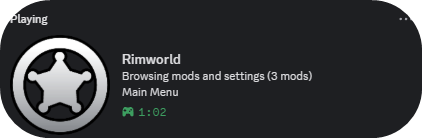
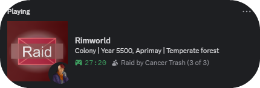
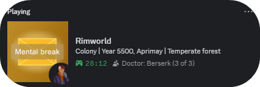
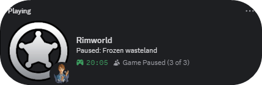

# RimCord

**Show off your colony in Discord**

---

## Preview

<table>
<tr>
<td align="center"><b>Main Menu</b></td>
<td align="center"><b>Raid Alert</b></td>
</tr>
<tr>
<td></td>
<td></td>
</tr>
<tr>
<td align="center"><b>Mental Break</b></td>
<td align="center"><b>Paused</b></td>
</tr>
<tr>
<td></td>
<td></td>
</tr>
</table>

---

## What is this?

RimCord adds Discord Rich Presence to RimWorld. Your friends can see what colony you're running, how many colonists you have, and when things go horribly wrong (raids, mental breaks).
> [!NOTE]
> Discord has rate limit of one update per 15 seconds, if too many events happen at once, it will update with most recent event.
---

## Features

**Colony Info** - Shows your colony name, colonist count, current year, and biome right in your Discord status.

**Live Events** - When a raid hits or someone has a mental break, your status updates automatically. Your friends will know exactly when to send thoughts and prayers.

**Context-Aware Pause** - When you pause, your status shows what you're dealing with:
- Raids: *"Paused: Planning counter-attack"*
- Mental breaks: *"Paused: Val is Berserk"*
- Traders: *"Paused: Haggling with orbital traders"*
- Weather: *"Paused: Frozen wasteland"*

**Mod Count** - In the main menu, it shows how many mods you're running. Because we all know that number is way too high.

**Storyteller Icons** - Displays your current storyteller as a small icon. Let everyone know Randy is ruining your day.

---

## Installation

1. Subscribe on [Steam Workshop](https://steamcommunity.com/sharedfiles/filedetails/?id=3599106147)
2. Enable the mod
3. Make sure Discord is running
4. That's it, really

---

## Settings

Find them in **Options > Mod Settings > RimCord**

You can toggle what shows up in your status:
- Colony name
- Colonist count (shows as party size)
- Biome
- Storyteller icon
- Custom button (add your Twitch or whatever)

---

## Troubleshooting

**Nothing showing up?**
Make sure Discord desktop app is running. The browser version doesn't support Rich Presence.

**Status stuck after closing the game?**
Press `Ctrl+R` in Discord to refresh.

**Can't see my own button?**
That's normal. Discord hides buttons from yourself - others can see it though.

---

## Languages

Fully translated in: English, German, Spanish, French, Italian, Polish, Portuguese, Russian, Chinese, Japanese, Korean

---

## License

MIT - do whatever you want with it.

---

**[Steam Workshop](https://steamcommunity.com/sharedfiles/filedetails/?id=3599106147)** | **[Report Issues](https://github.com/L0veNote/RimCord/issues)**

