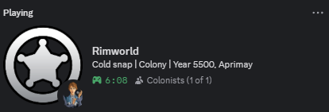

# RimCord

**Discord Rich Presence for RimWorld colonies**

---

## Preview

<table>
<tr>
<td align="center"><b>In Game</b></td>
<td align="center"><b>Raid Alert</b></td>
</tr>
<tr>
<td></td>
<td></td>
</tr>
<tr>
<td align="center"><b>Mental Break</b></td>
<td align="center"><b>Paused</b></td>
</tr>
<tr>
<td></td>
<td></td>
</tr>
</table>

---

## What is this?

RimCord adds Discord Rich Presence to RimWorld. Your friends can see what colony you are running, how many colonists you have, and when major colony events happen.

> [!NOTE]
> Discord is limited to one presence update every 15 seconds. If multiple events occur within that window, the most recent event will be shown.

---

## Features

**Colony status** - Shows your colony name, current year, quadrum, biome, storyteller icon, and colonist count in Discord.

**Colonist count** - Shows your current colonists as Discord party size.

**Brief letter events** - Vanilla and modded letters can update presence with short event text.

**Threat and event context** - Raids, mental breaks, game conditions, and other letters can update your status. Letter events, threat alerts, and game conditions can be toggled separately.

**Pause context** - If the game stays paused for about 1 minute, Discord can show what is happening, such as:
- `Paused: Planning counter-attack`
- `Paused: Val is Berserk`
- `Paused: Haggling with orbital traders`
- `Paused: Frozen wasteland`

**Main menu status** - Shows `Main Menu` with the current active mod count.

**Custom button** - Adds one optional Discord button with your own label and HTTPS URL.

---

## Installation

1. Subscribe on [Steam Workshop](https://steamcommunity.com/sharedfiles/filedetails/?id=3599106147)
2. Enable RimCord and Harmony in RimWorld
3. Start the Discord desktop app
4. Launch or load a colony

> [!IMPORTANT]
> Discord Rich Presence requires the Discord desktop app. Browser Discord cannot receive Rich Presence from RimWorld.

---

## Settings

Find them in **Options > Mod Settings > RimCord**

You can toggle what shows up in your status:
- Colony name
- Colonist count (shows as party size)
- Biome
- Storyteller icon
- Letter events
- Threat alerts (raids + mental breaks)
- Game conditions
- Custom button label and HTTPS URL

---

## Troubleshooting

**Nothing showing up?**
Make sure Discord desktop app is running. The browser version doesn't support Rich Presence.

**Status stuck after closing the game?**
Press `Ctrl+R` in Discord to refresh.

**Colonist count looks stale?**
Leave the colony running for about a minute. RimCord refreshes the count regularly while you play.

**Can't see my own button?**
That's normal. Discord hides buttons from yourself - others can see it though.

---

## Languages

Included languages: English, German, Spanish, French, Italian, Polish, Portuguese, Russian, Chinese, Japanese, Korean.

> [!TIP]
> Non-English translations are generated with DeepL. If you want to help improve them, corrections are welcome through GitHub issues or pull requests.

---

## License

MIT

---

**[Steam Workshop](https://steamcommunity.com/sharedfiles/filedetails/?id=3599106147)** | **[Report Issues](https://github.com/L0veNote/RimCord/issues)**

